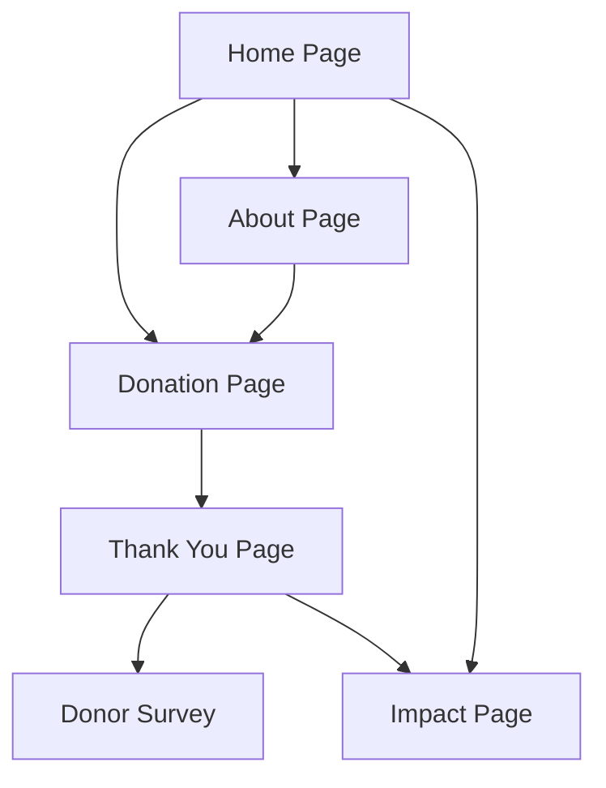

# Gaza Children Fundraising Website - Product Requirements Document

## 1. Product Overview

A compassionate and professional fundraising website designed to support children in Gaza as part of a university International Fundraising & Digital Campaign module project. The platform enables secure donation collection while maintaining transparency about its academic nature and ensuring all contributions directly benefit the stated humanitarian cause.

The website serves as a practical learning tool for cross-cultural communication, persuasive outreach, and digital marketing while addressing a meaningful humanitarian need through respectful and transparent fundraising practices.

## 2. Core Features

### 2.1 User Roles

| Role | Registration Method | Core Permissions |
|------|---------------------|------------------|
| Visitor | No registration required | Can browse content, view donation progress, access information |
| Donor | Optional contact info during donation | Can make donations, receive confirmation, access donor survey |
| Administrator | Direct access (student project owner) | Can update content, view analytics, manage donation records |

### 2.2 Feature Module

Our Gaza children fundraising website consists of the following essential pages:

1. **Home Page**: Hero section with compelling imagery, donation progress tracker, quick donation buttons, cause overview
2. **About Page**: Student introduction, project purpose, cause details, fund usage transparency
3. **Donation Page**: Secure payment form, amount selection, donor information collection, payment processing simulation
4. **Thank You Page**: Donation confirmation, receipt display, donor survey link, social sharing options
5. **Impact Page**: Stories and testimonials, progress updates, transparency reports

### 2.3 Page Details

| Page Name | Module Name | Feature Description |
|-----------|-------------|---------------------|
| Home Page | Hero Section | Display compelling Gaza children imagery with emotional storytelling, clear project identification as university activity |
| Home Page | Donation Progress | Show real-time donation tracker with target vs raised amounts, donor count display |
| Home Page | Quick Donate | Provide preset donation amounts ($10, $25, $50, $100) with prominent call-to-action buttons |
| About Page | Student Introduction | Present student name, university, module details as required by academic guidelines |
| About Page | Project Purpose | Explain academic objectives, learning goals, and transparent project nature |
| About Page | Cause Details | Describe Gaza children's situation with respectful, factual information and fund usage plans |
| Donation Page | Payment Form | Collect card information (number, expiry, CVC) with secure-looking design and validation |
| Donation Page | Donor Information | Gather donor name, email, country, and optional message with clear privacy statements |
| Donation Page | Amount Selection | Allow custom amounts and preset options with currency conversion display |
| Thank You Page | Confirmation Display | Show donation receipt with transaction ID, amount, and clear test/demo disclaimers |
| Thank You Page | Survey Integration | Provide link to Google Forms donor feedback survey for project requirements |
| Impact Page | Transparency Report | Display how donations are used, project updates, and academic compliance information |

## 3. Core Process

**Visitor Flow:**
1. Visitor lands on homepage and views compelling content about Gaza children
2. Reads about project purpose and student introduction in About section
3. Decides to donate and navigates to Donation page
4. Selects donation amount and fills payment form (mock processing)
5. Receives confirmation on Thank You page with survey link
6. Optionally completes donor feedback survey

**Administrator Flow:**
1. Student accesses backend/admin tools to update content
2. Monitors donation progress and analytics
3. Downloads transaction logs for Excel record-keeping
4. Updates impact stories and transparency reports
5. Manages donor survey responses and feedback

## 4. User Interface Design

### 4.1 Design Style

- **Primary Colors**: Deep blue (#1e3a8a) for trust and stability, warm orange (#f97316) for hope and action
- **Secondary Colors**: Soft gray (#f8fafc) for backgrounds, dark gray (#374151) for text
- **Button Style**: Rounded corners with subtle shadows, gradient effects for donation buttons
- **Typography**: Inter font family for modern readability, 16px base size, clear hierarchy with bold headings
- **Layout Style**: Card-based design with clean spacing, top navigation with sticky donation button
- **Icons**: Feather icons for consistency, heart and shield icons for trust elements

### 4.2 Page Design Overview

| Page Name | Module Name | UI Elements |
|-----------|-------------|-------------|
| Home Page | Hero Section | Full-width background image, overlay text with student introduction, prominent "Donate Now" button in orange |
| Home Page | Progress Tracker | Circular progress indicator, raised amount display, donor count with animated counters |
| Donation Page | Payment Form | Card-style layout with secure lock icons, input validation indicators, SSL-style security badges |
| Thank You Page | Confirmation | Success checkmark animation, receipt-style layout, clear test disclaimer in highlighted box |
| Impact Page | Stories Section | Grid layout with image cards, testimonial quotes, progress photos with before/after comparisons |

### 4.3 Responsiveness

The website follows a mobile-first approach with responsive breakpoints at 768px (tablet) and 1024px (desktop). Touch-optimized donation buttons and forms ensure seamless mobile experience, with simplified navigation and stacked layouts on smaller screens.
