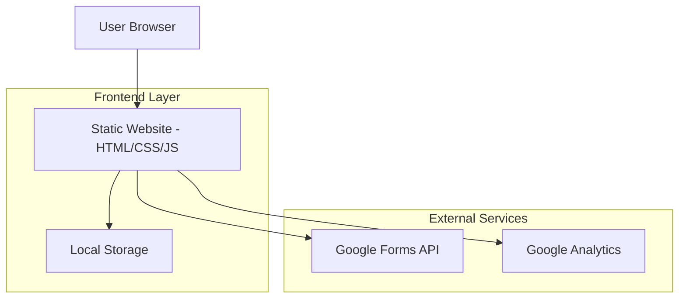
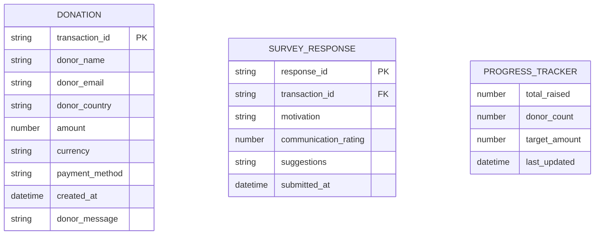

# Gaza Children Fundraising Website - Technical Architecture Document

## 1. Architecture Design



## 2. Technology Description

- **Frontend**: HTML5 + CSS3 + Vanilla JavaScript + Bootstrap 5
- **Backend**: None (Static Website)
- **Data Storage**: Google Forms + Local Storage
- **Analytics**: Google Analytics 4

## 3. Route Definitions

| Route | Purpose |
|-------|---------|
| /index.html | Home page with hero section, donation progress, and quick donate options |
| /about.html | About page with student introduction, project purpose, and cause details |
| /donate.html | Donation page with payment form and donor information collection |
| /thankyou.html | Thank you page with confirmation message and survey link |
| /impact.html | Impact page with stories, testimonials, and transparency reports |

## 4. API Definitions

### 4.1 Core API

**Google Forms Integration**
```
POST https://docs.google.com/forms/d/e/{FORM_ID}/formResponse
```

Request Parameters:
| Param Name | Param Type | isRequired | Description |
|------------|------------|------------|-------------|
| entry.{field_id} | string | true | Donor name |
| entry.{field_id} | string | true | Donor email |
| entry.{field_id} | string | true | Donor country |
| entry.{field_id} | number | true | Donation amount |
| entry.{field_id} | string | true | Payment method |
| entry.{field_id} | string | true | Transaction timestamp |
| entry.{field_id} | string | false | Donor message |

**Local Storage Schema**
```javascript
// Donation Progress Tracking
{
  "totalRaised": 0,
  "donorCount": 0,
  "target": 10000,
  "lastUpdated": "2025-01-01T00:00:00Z"
}

// Transaction Log
{
  "transactions": [
    {
      "id": "TXN_001",
      "amount": 50,
      "currency": "USD",
      "donor": "Anonymous",
      "country": "USA",
      "timestamp": "2025-01-01T12:00:00Z",
      "method": "Credit Card"
    }
  ]
}
```

## 5. Data Model

### 5.1 Data Model Definition



### 5.2 Data Definition Language

**Google Forms Structure**

Donation Form Fields:
```
1. Donor Name (Short Answer)
2. Email Address (Email)
3. Country (Dropdown)
4. Donation Amount (Number)
5. Currency (Dropdown - USD, EUR, GBP)
6. Payment Method (Multiple Choice - Credit Card, Debit Card, PayPal)
7. Transaction ID (Short Answer)
8. Timestamp (Date & Time)
9. Donor Message (Paragraph - Optional)
```

Donor Survey Form Fields:
```
1. Transaction Reference (Short Answer)
2. What motivated you to donate? (Multiple Choice)
   - Humanitarian concern
   - Educational support
   - Personal connection
   - Social media influence
   - Other
3. How effective was our communication? (Linear Scale 1-5)
4. Suggestions for future campaigns (Paragraph)
5. Would you donate again? (Yes/No)
6. How did you hear about us? (Multiple Choice)
```

**Local Storage Initialization**
```javascript
// Initialize donation progress
if (!localStorage.getItem('donationProgress')) {
  localStorage.setItem('donationProgress', JSON.stringify({
    totalRaised: 0,
    donorCount: 0,
    target: 10000,
    lastUpdated: new Date().toISOString()
  }));
}

// Initialize transaction log
if (!localStorage.getItem('transactionLog')) {
  localStorage.setItem('transactionLog', JSON.stringify({
    transactions: []
  }));
}
```